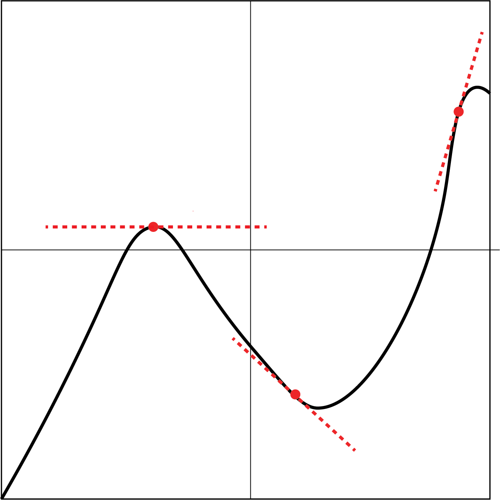

# A short recap of derivatives

We will be working with ordinary differential equations (ODEs), which we describe as functions that include derivatives. For the purpose of jogging our memory, let's remind ourselves what a derivative is.

::: {.callout-tip}
## Resources to learn derivatives
I really like the [Calculus in Context](http://www.science.smith.edu/~callahan/intromine.html) which is absolutely free. Check out the chapter for the derivative. Also the famous Paul's Online Notes would be great. Finally, Otto and Day has a nice appendix on the basic calculus rules you need.
:::

```{r, echo= FALSE}
library(ggplot2)
library(ggimage)
```

### What is a derivative?
Fundamentally, a **derivative** describes the **rate of change** as we are interested in how rapidly a quantity changes. For example, in many ecological models, we are often interested in how the size of the population changes over time. Graphically, the derivative can be the tangent line at a specific point:

{width="667"}

The more formal definition of a derivative is:

$$
\lim_{h\to 0} \frac{f(x + h) - f(x)}{h}.
$$ 

This equation says that the derivative of a function $f$ at a point $x$ is found by taking the difference between the function's value at $x+h$
and at $x$, and then dividing by $h$. We then imagine making $h$ very, very small---that is, letting $h$
approach $0$. The limit of this expression as $h \to 0$ gives the instantaneous rate of change of the function at $x$, which is the derivative.

In a car analogy, the speedometer shows how fast we are going. As I'm driving through Boston, there may be moments when I'm driving very fast but then brake suddenly. Let's say you're taking a photo from the back seat of the car. When you take a snapshot, you're capturing the instantaneous rate of change.

## Connection with differential equations

Differential equations as described by Otto and Day are:  *"An equation relating the derivative of a variable to a function of the variable itself..."*. Most of the time, we're trying to solve for the function.

Examples include:

$$\frac{dN}{dt} = rN(t), 
$$

where we have the function $N(t)$ as well as the derivative of $N(t)$. So this is a differential equation.